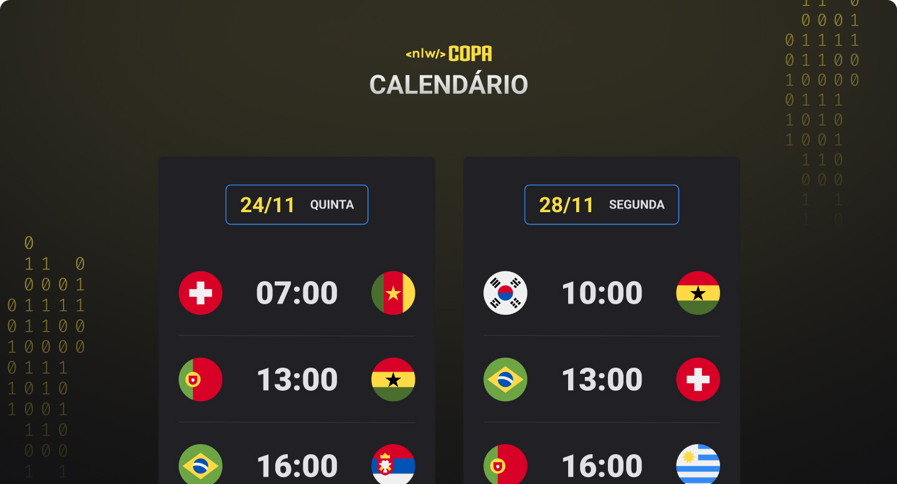

<h1 align="center"> NLW #10 COPA </h1>

Evento exclusivo e gratuito, promovido pela Rocketseat para ensino de tecnologias WEB.

  <a href="#-tecnologias">Tecnologias</a>&nbsp;&nbsp;&nbsp;|&nbsp;&nbsp;&nbsp;
  <a href="#-projeto">Projeto</a>&nbsp;&nbsp;&nbsp;|&nbsp;&nbsp;&nbsp;
  <a href="#-layout">Layout</a>&nbsp;&nbsp;&nbsp;|&nbsp;&nbsp;&nbsp;
  <a href="#memo-licença">Licença</a>

  

 

  

 

## 🚀 Tecnologias

Esse projeto foi desenvolvido com as seguintes tecnologias:

- HTML
- CSS
- JavaScript
- Git e GitHub

 

## 💻 Projeto

O Calendário da Copa é um projeto que mostra os jogos da Copa de 2022.

[🔗 Acesse aqui](https://dzzanis.github.io/cup-calendar)

 

## 🔖 Layout

Você pode visualizar o layout do projeto através [desse link](https://www.figma.com/community/file/1169028052212317700/duplicate). É necessário ter conta no [Figma](https://figma.com) para acessá-lo.

 

## :memo: Licença

Esse projeto está sob a licença MIT.

---

Feito com ♥ by Diogo Zanis :wave: [LinkedIn](https://www.linkedin.com/in/diogo-zanis-51539a121)
